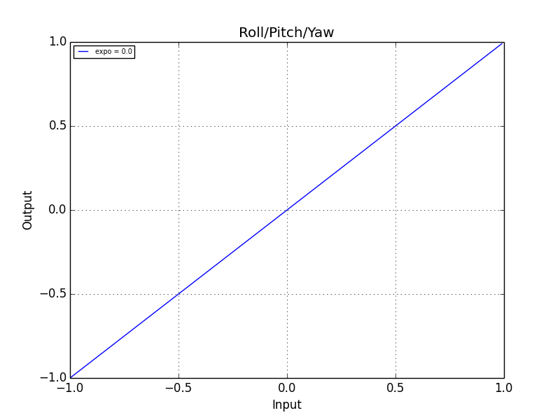
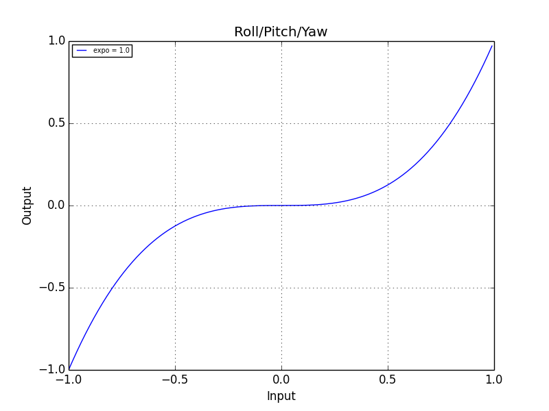
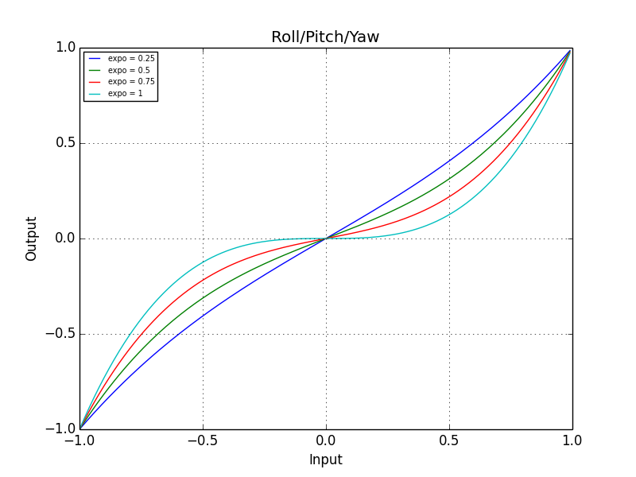
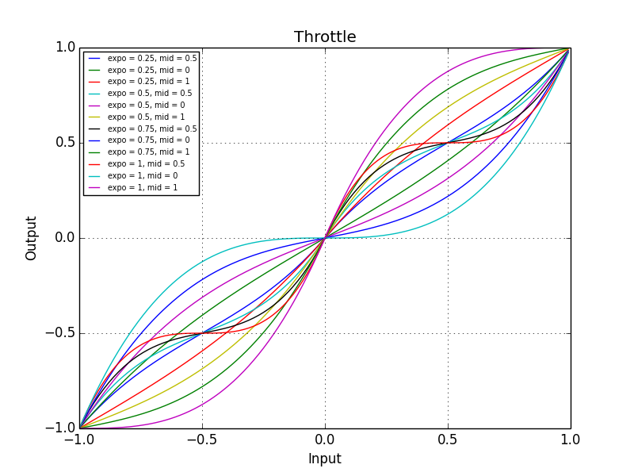

# Stick Input

## How INAV interprets the sticks

INAV maps all stick input to `[-1, 1]`. The orientations for each axis are:

| Axis     | \> 0    | \< 0    |
|----------|---------|---------|
| Roll     | Right   | Left    |
| Pitch    | Up      | Down    |
| Yaw      | Right   | Left    |
| Throttle | Forward | Reverse |

Roll, Pitch and Yaw sticks are always mapped to the full `[-1, 1]` range. Throttle,
however, is a bit different. Depending on the current flight mode, throttle might be
mapped to `[0, 1]` (forward movement only, used in most cases), `[-1, 0]` (reverse
movement only, used in e.g. airplane brake mode by reverse thrust) or `[-1, 1]` (full 3D
mode).

## Curves

INAV supports input curves, which allow making the input from the sticks non-linear.
In practical terms, this means you can make the stick less sensitive around the center
region and more sensitive near the edges while still having full range. This function is
known as `expo` in a lot of radios.

### Roll, Pitch and Yaw curves

Roll, Pitch and Yaw (sometimes referenced as just RPY in other documentation and the
source code) support a single `expo` parameter exposed as a several settings (`rc_expo`,
`rc_yaw_expo`, `manual_rc_expo`, `rc_yaw_expo`, etc...). Settings which contain the `yaw`
word apply only to the Yaw axis, while settings without it apply to Pitch and Roll. On
the other hand, settings starting with `manual` apply to manual control modes (at this
time this includes only the `MANUAL` mode), while settings without it apply to all
control modes but manual ones.

These settings accept values in the `[0, 100]` range, which are internally mapped to
`[0, 1]`. A value of `0` provides a full linear response, while a value of `100`
represents the least possible sensitivity around the center. This is implemented with the
following function:

```
    f(x, expo) = ((1 - expo) * x) + (expo * (x^3)) // x ∈ [-1, 1], expo ∈ [0, 1]
```

Substituting `expo` with `0` we get:

```
    f(x, 0) = ((1 - 0) * x) + (0 * (x^3)) = x
```

Which gives a completely linear response:



Substituting `expo` with `1` we get:

```
    f(x, 1) = ((1 - 1) * x) + (1 * (x^3)) = x^3
```

Which gives us a curve defined by the cubic equation:



Values between `0` and `1` produce curves with varying degrees of sensitivity around
the center region of the stick.




### Throttle curves

Throttle is a bit different because the center region of the stick might represent
different values, depending on wether forward, backward of bidirectional movement is
active. Additionally throttle supports another parameter besides `expo` (`thr_expo`
setting, same values as other expo settings `[0, 100]`), called `mid` (`thr_mid` setting,
also with values in `[0, 100]`), which represents the inflection point of the curve.

Throttle curve is defined by the following function:

```
    f(x, expo, mid) = -f(-x, expo, mid) iff x < 0

    tmp = x - mid
    y = tmp > 0 ? (1 - mid) : tmp < 0 ? mid : 1
    f(x, expo, mid) = mid + tmp * (1 - expo + expo * tmp**2 / y**2)
```

Note that this is different than the RPY curves, since the positive and negative halves
of the input are handled separately and `expo` produces an inflection point on each side
of the input axis. The effect of `expo` and `mid` can be seen in the following graph:




### Curve development and testing

All the previous graphs can be generated with the script in `src/utils/rc-curves.py`.
Curve implementations in the script must be kept in sync with the actual implementation
found in `src/main/fc/rc_curves.c`.
